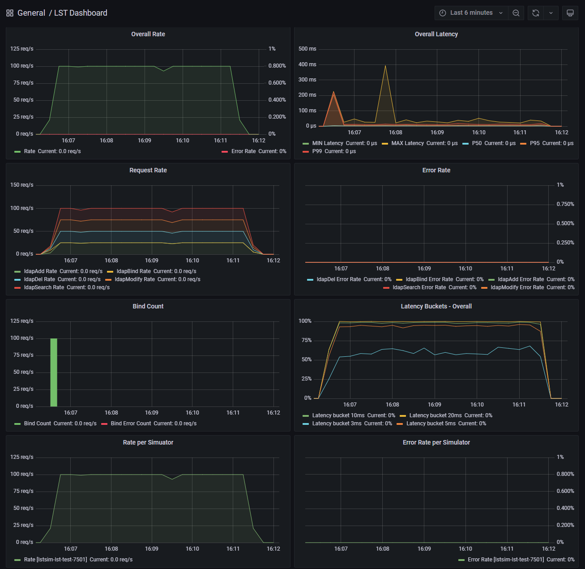
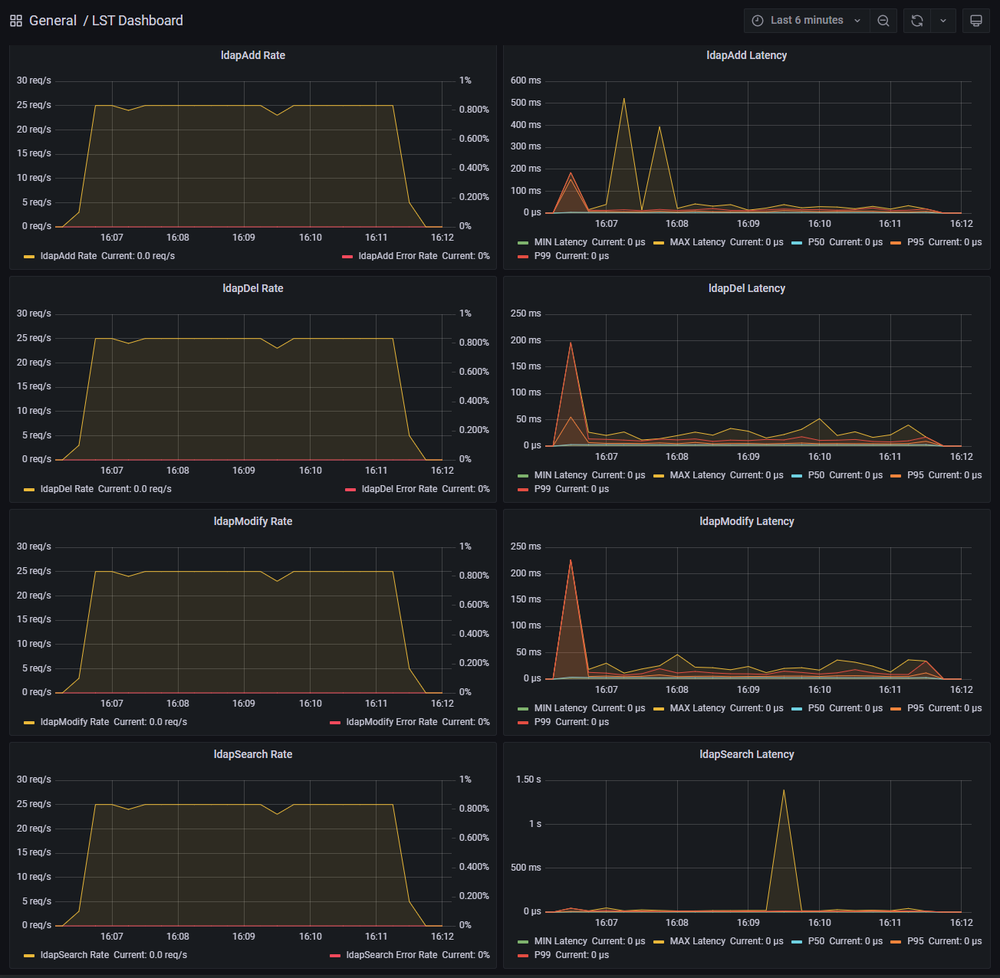
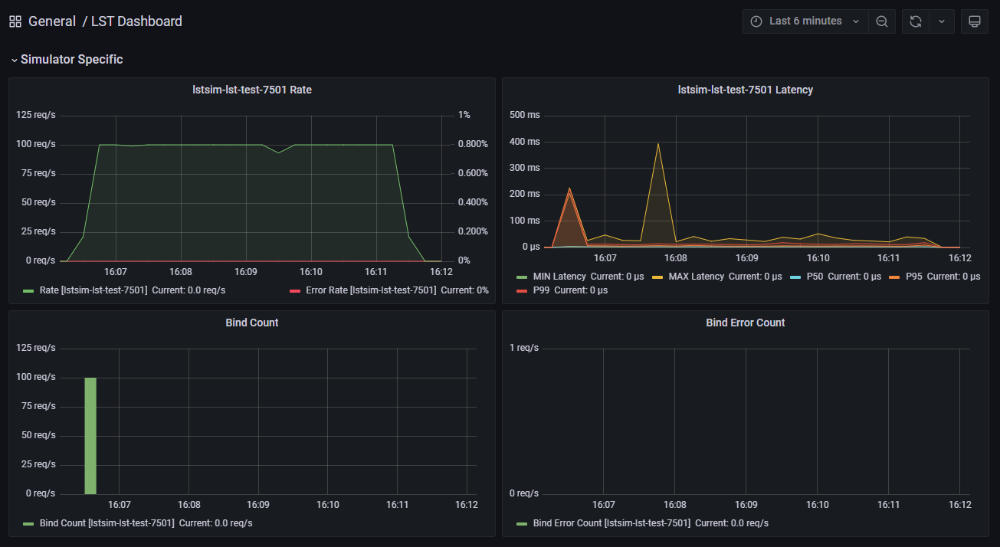
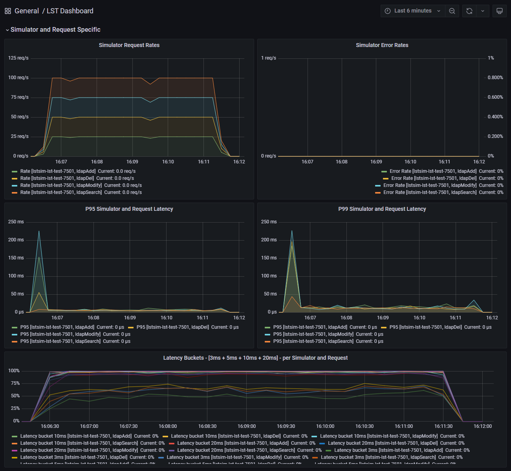

# Grafana Dashboard

Examples:

- [Test Results](#test-overview)
- [Request Metrics](#request-specific-metrics)
- [Simulator Metrics](#simulator-metrics)
- [Detailed Metrics](#detailed-metrics)

# Test Overview

# Request Specific Metrics

# Simulator Metrics

# Detailed Metrics

